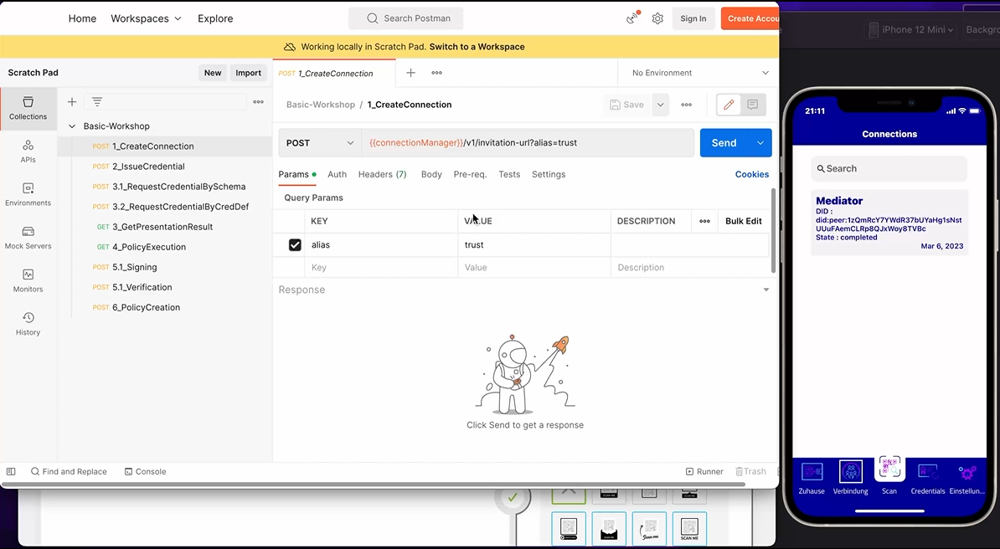

# Overview

Trusted connections are a basic concept of didcomm to ensure the trust between two parties. These connections are later on used for issuing, messaging, presentation of credentials etc. Therefore this exercise will show how to create a connection and how does it looks like. More detailed information can be found under the [Aries RFC 160](https://github.com/hyperledger/aries-rfcs/tree/main/features/0160-connection-protocol)

Basic Flow:

  

# Exercise Goal

The goal of the exercise is, to go in touch with trusted connections of the hyperledger aries/didcomm universe and establishing the first connections between PCM/OCM manually.

# Exercise

Use the 1_CreateConnection Request from the postman collection and request an invitation url. Transform the invitation url into a QR Code and scan it with the PCM. You should see a new connection in the PCM under connections.

