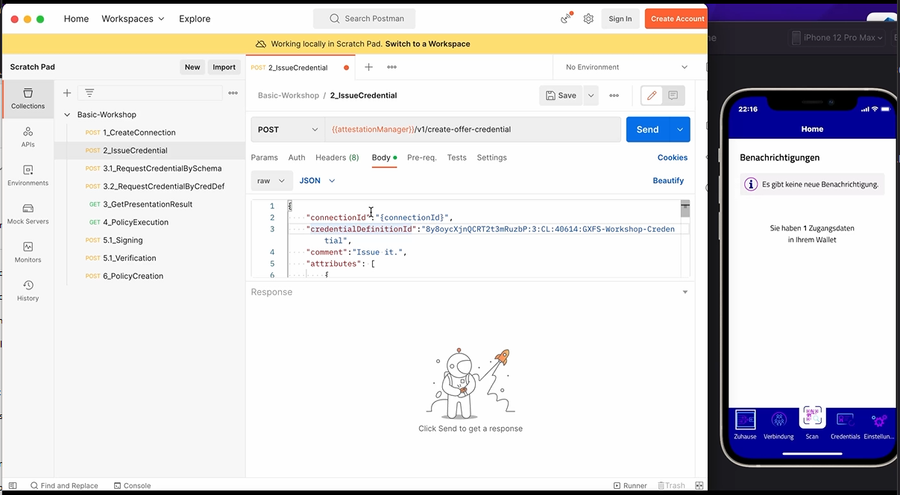

# Overview

Credential Issuing with Hyperledger Aries is an essential basic requirement for using selective disclosure and cryptographic proofs. In this exercise, the basic issuing is used in combination with the PCM. More detailed information can be found in [Aries RFC 0036](https://github.com/hyperledger/aries-rfcs/tree/main/features/0036-issue-credential)


# Exercise Goal

The goal of this exercise is to issue the first credentials to the PCM, play arround with the values and talk about side conditions and relations to other topics.

# Exercise

Use the 2_IssueCredential Request from the Postman collection and request with the body below the credential issuing by using the attestation url. Use for connection id, the id which you got from exercise one.

```
{
    "connectionId":"{connectionId}",
    "credentialDefinitionId":"8y8oycXjnQCRT2t3mRuzbP:3:CL:40614:GXFS-Workshop-Credential",
    "comment":"First Credential",
    "attributes": [
        {
           "name": "email",
           "value":"meineEmail@email"
        },
        {
            "name":"userName",
            "value":"workshopatttendee"
        },
        {
            "name":"birthdate",
            "value":"01.01.2023"
        },
        {
            "name":"cardNumber",
            "value":"123456"
        },
        {
            "name":"identifier",
            "value":"urn:id:123456"
        }
    ],
    "autoAcceptCredential":"never"

}

```


[](media/CredentialIssuance.mp4 "Credential Issuance")


After this simple issuance, let's try it with a more complex [one](https://idunion.esatus.com/tx/IDunion_Test/domain/40745): 

<p align="center">
  
</p>

This should be triggered by using: 

```
{
    "connectionId":"{connectionId}",
    "credentialDefinitionId":"8y8oycXjnQCRT2t3mRuzbP:3:CL:33627:principalCredential-integration-1.3",
    "comment":"Issue it.",
    "attributes": [
        {
           "name": "Email",
           "value":"meineEmail@email"
        },
        {
            "name":"PreferredUsername",
            "value":"workshopatttendee"
        },
        {
            "name":"FirstName",
            "value":"Test"
        },
        {
            "name":"MiddleName",
            "value":"Test"
        },
        {
            "name":"LastName",
            "value":"Test"
        },
        {
            "name":"Gender",
            "value":"M"
        },
        {
            "name":"Birthdate",
            "value":"01.01.2023"
        },
        {
            "name":"FederationId",
            "value":"123456"
        },
        {
            "name":"subjectDID",
            "value":"urn:id:123456"
        },
        {
            "name":"Claims",
            "value":"Test"
        },
        {
            "name":"issuerDID",
            "value":"Test"
        }
    ],
    "autoAcceptCredential":"never"

}

```
