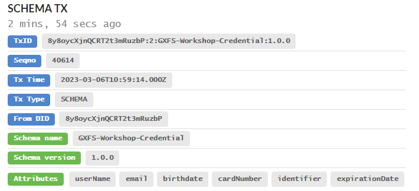

# Preperation

At first a credential schema was created for the workshop by using the [Schema.json](/IDM%26Trust/Basics/Exercises/Preperation/Schema.json).This results in a credential schema 8y8oycXjnQCRT2t3mRuzbP:2:GXFS-Workshop-Credential:1.0.0 which is explorable under [Indy TX Explorer](https://idunion.esatus.com/tx/IDunion_Test/domain/40614)

  

After this a Credential Definition was created to use it for credential issuing. The credential definition is created by using the schema created above in the [request json](/IDM%26Trust/Basics/Exercises/Preperation/CredDef.json). The resulting CredDef 8y8oycXjnQCRT2t3mRuzbP:3:CL:40614:GXFS-Workshop-Credential is later on used for issuing credentials. It's also visible on the [ledger](https://idunion.esatus.com/tx/IDunion_Test/domain/40619).

  

