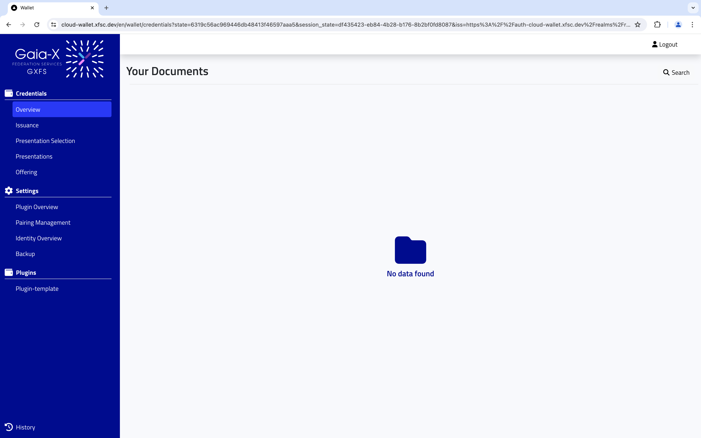
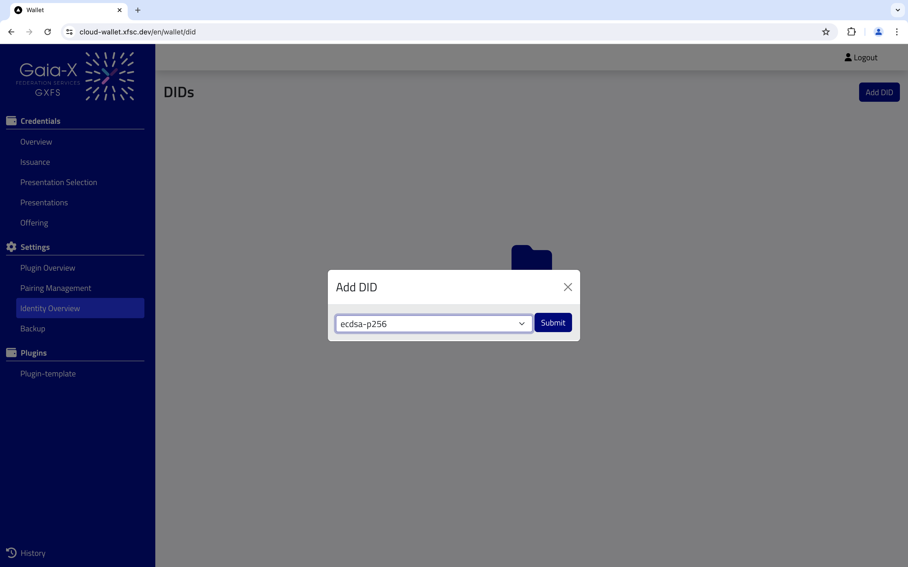
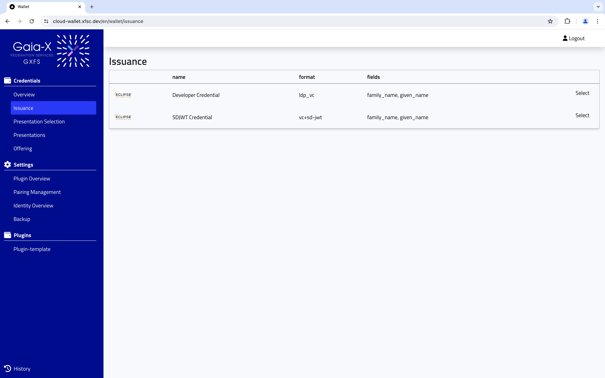
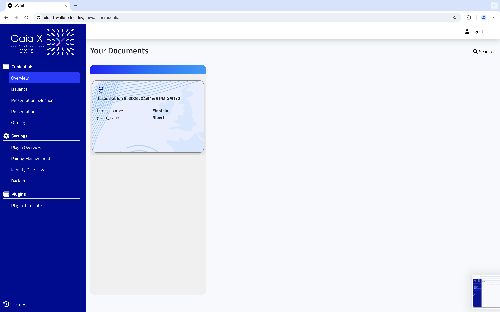
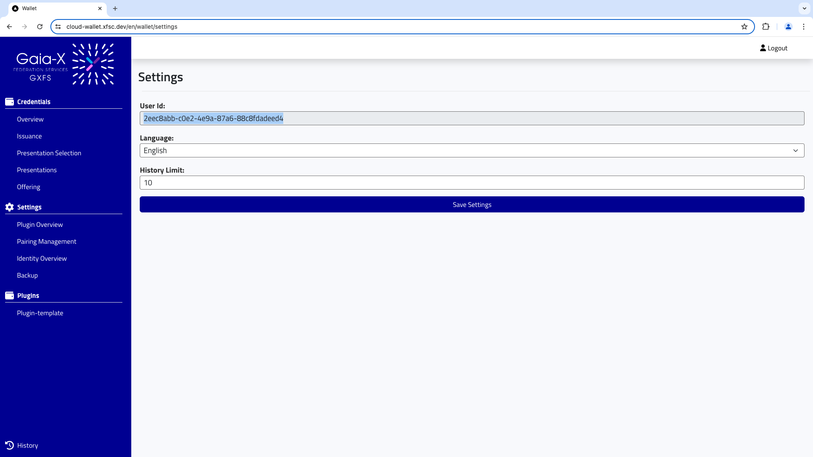

# PCM Cloud Exercise

## Create a user

1. Go to the register tab.


2. Add details to create a new user.


3. You are logged in!



## Create a DID and issue a credential

1. We should start with creating our first DID. Go to identity overview and click on the Add button.


2. Choose the type of key associated with DID verification method and submit.



3. Now we can see details of created DID in the identity overview page.


4. Let's start with credential issuance. Go to the Issuance tab.



5. Select the type of credential you would like to issuer and enter the data which will be stored as credential subject.


6. Now a modal window with credential offer can be seen. It includes encoded issued credential data. Please press Copy button.


7. Go to Offering tab and press Add button. Now paste the copied credential offer data in the input field. Press the Submit button.


8. Now we can see the added offering in the offering list. Pressing Accept will issue the credential. Deny will remove the offering. Press Accept.


9. Select DID from the list and press Accept.


10. Offering is accepted. Now please go to Overview tab. Here you can see an issued credential.



## Create presentation

1. Before creating a presentation, we need to create a presentation request that will be sent by the verifier over NATS message broker. There is an exposed endpoint for demo purposes that can be used to create a presentation request.
Please go to settings tab and copypaste your User ID. Then execute a request.



 ```bash
 curl -X POST -d '{"userId":"<USER ID>"}' https://cloud-wallet.xfsc.dev/presentation-demo/request

 ```
2. Go to Presentation Selection tab. Select a created request.


3. Use drag and drop to choose credentials that will be included in the presentation. Choose a did document used for creating proof. Press Confirm.


4. You are redirected to Presentations tab. Here you can see the created presentation.


